<div align="center">

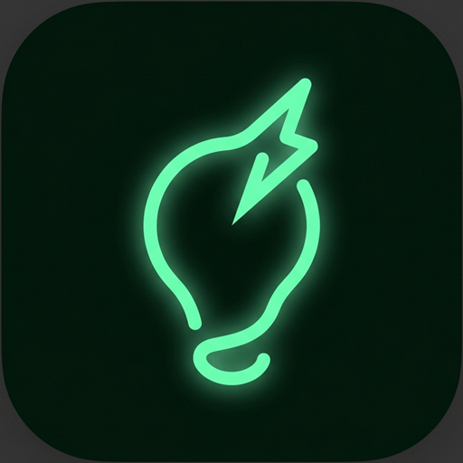

# Pique

### Get curious. Then get to work.

A personalized **5–20 minute curiosity warm-up** that makes your next task interesting *before* you start it,
then **locks the app** and sends you back to work.

<br/>

[](https://github.com/shishirastogi/Pique/releases/tag/android-apk-latest)
[](https://pique-api-175706581364.asia-south1.run.app)
[](https://github.com/shishirastogi/Pique/actions)


</div>

---

## Table of Contents

- [Summary](#-summary)
- [Why Pique exists](#-why-pique-exists)
- [Screenshots](#-screenshots)
- [Features](#-features)
- [How to use it](#-how-to-use-it)
- [Architecture](#-architecture)
- [How a session is built](#-how-a-session-is-built)
- [Tech stack](#-tech-stack)
- [How the app was made](#-how-the-app-was-made)
- [Project structure](#-project-structure)
- [Run it locally](#-run-it-locally)
- [Build the Android APK](#-build-the-android-apk)
- [Deployment](#-deployment)
- [Documentation](#-documentation)

---

## ✨ Summary

Starting a task is the hardest part. Pique is **not** a feed and **not** a distraction. It is a short,
finite, personalised session of memes, facts, analogies, visuals and mini-challenges **about the very thing you
are about to work on**, so the task feels interesting by the time you begin.

When the countdown ends, Pique **locks itself** for a set period so your attention stays on the work.

> **Optimise for task initiation, not time-in-app.**

| | |
|---|---|
| ⏱️ **Warm-up length** | 5, 10, 15 or 20 minutes |
| 🃏 **Cards per session** | ~2 per minute (10 to 36 cards), always finite |
| 🔒 **Lock after session** | 1 to 8 hours (default 2 h), enforced by the server |
| 🧠 **Personalised** | Cards are generated and ranked around *your* topic |
| 📱 **Platforms** | Android app (Capacitor) and web |

---

## 🎯 Why Pique exists

| Common problem | What Pique does instead |
|---|---|
| Infinite feeds eat your focus | Sessions are **finite and pre-generated**. There is no "next forever" |
| Procrastination before a boring task | Makes the topic **curious first**, then hands you back to it |
| Engagement-bait apps | No likes, no followers, no streak pressure |
| Willpower alone does not work | A **visible countdown, a hard stop and a lock** |

### Golden rules

1. **No infinite feed.** Sessions are finite sequences.
2. **No engagement loops.** No likes feed, followers, or streak pressure.
3. **Visible countdown + hard stop + lock.** Always.
4. **Provenance for every external asset.** Attribution is kept and shown.
5. **Optimise for task initiation**, never for minutes spent in the app.

---

## 📸 Screenshots

<div align="center">

| Welcome | How it works | Fill the details |
|:---:|:---:|:---:|
| 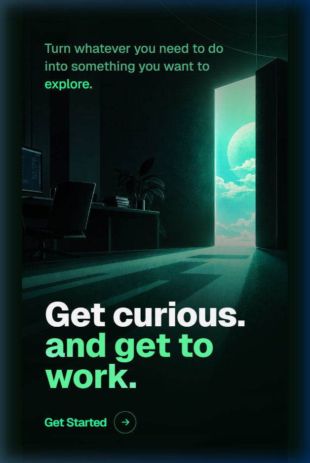 | 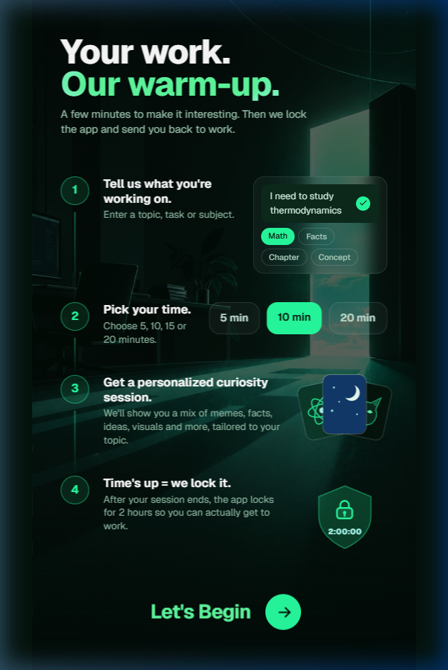 | 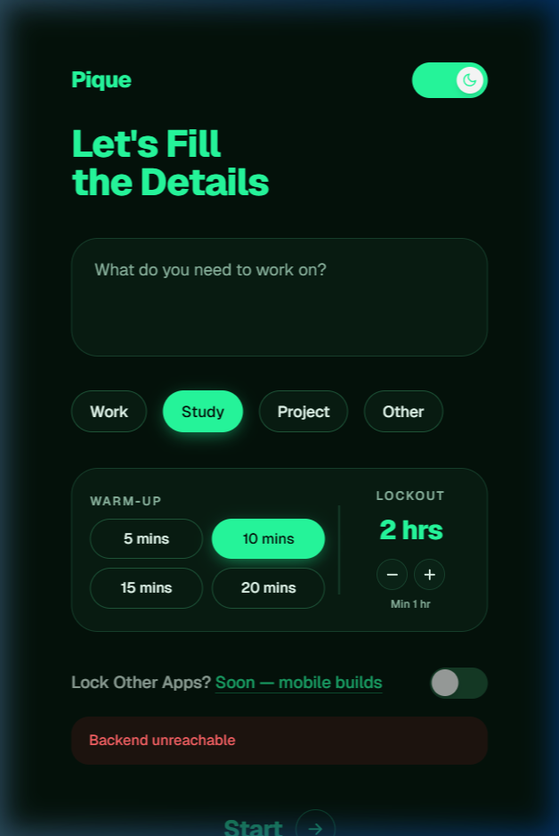 |
| *First launch only* | *First launch only* | *Topic, warm-up time, lockout* |

| Session card | Next card | Interaction |
|:---:|:---:|:---:|
| 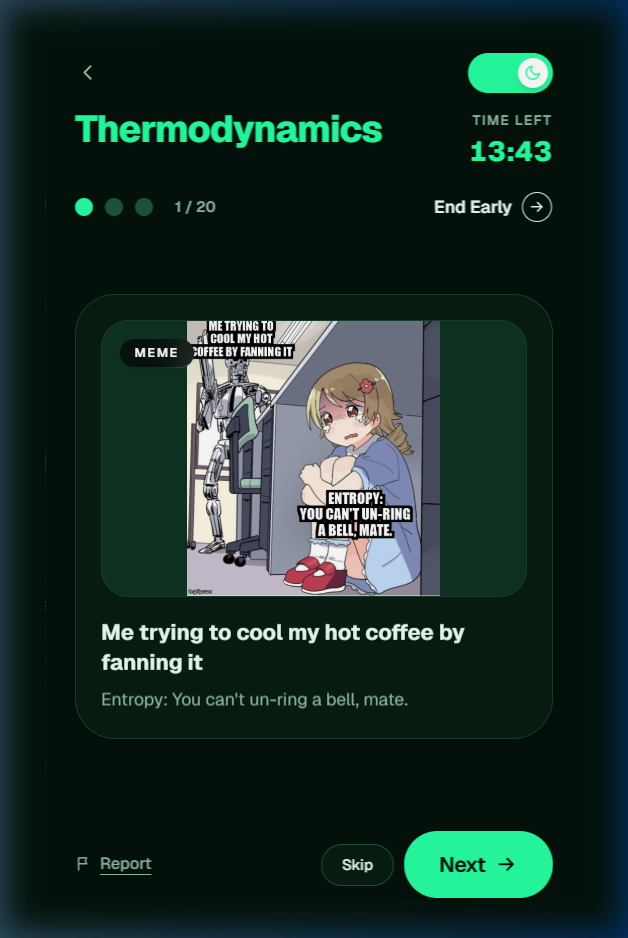 | 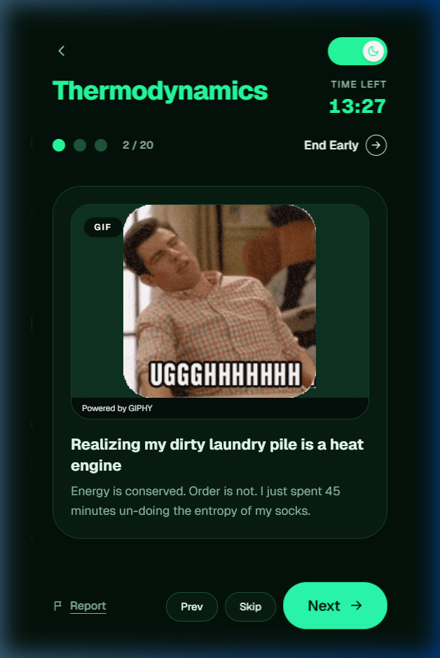 | 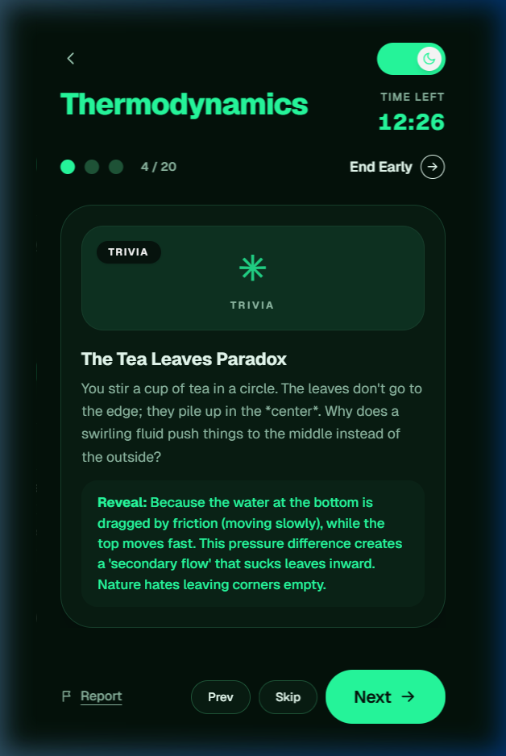 |
| *Countdown + progress* | *Swipe or tap Next* | *Reveal, polls, challenges* |

| Locked |
|:---:|
| 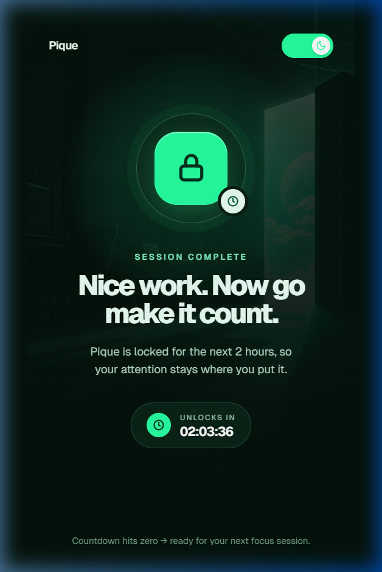 |
| *Session complete, app locked until the timer ends* |

</div>

---

## 🧩 Features

- 🚀 **One-time onboarding.** Welcome and *How it works* appear only on first install. After that the app opens straight on **Fill Details**.
- 📝 **Natural-language task input.** Type *"I need to study thermodynamics"*. An LLM parser (with an offline heuristic fallback) extracts topic, goal and level, and asks a clarifying question only if it must.
- 🃏 **16 card types.** Meme, did-you-know, quote, analogy, poll, question, mini story, trivia, historical context, diagram, GIF, micro-lesson, challenge, first-step nudge and book excerpt.
- 👆 **Swipe navigation.** Swipe left/right (or use Prev / Skip / Next). Cards resize smoothly and scroll on small phones.
- ⏳ **Server-authoritative timer.** Pause on app minimise or screen lock, resume seamlessly, resume a session after a restart.
- 🔒 **Lockout.** 1 to 8 hours, enforced by the backend so reinstalling the UI does not bypass it.
- 🌗 **Light and dark themes** with smooth screen transitions and card animations.
- 🛡️ **Report button** on every card, plus licence attribution shown when required.
- 🌐 **Real content providers.** Wikipedia, Wikimedia Commons, Openverse and Project Gutenberg, plus optional GIPHY and Imgflip.

> ℹ️ *Lock other apps* is a planned native-only feature and is shown as "Soon" in the UI. The emergency-unlock option was intentionally removed.

---

## 📖 How to use it

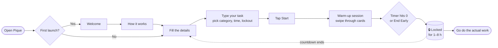

1. **Install** the APK from the [Releases page](https://github.com/shishirastogi/Pique/releases/tag/android-apk-latest) and allow *install from unknown sources*.
2. **Open Pique.** On first launch, read the two intro screens, then tap **Let's Begin**.
3. **Describe your task** (for example *"I need to study thermodynamics"*), pick a category, a warm-up length (5, 10, 15 or 20 min) and a lockout period (minimum 1 h).
4. Tap **Start**. Swipe through the cards, tapping **Reveal**, **Show hint** or poll options as you like. Use **Skip** or **Next** to move on.
5. When the timer reaches zero (or you choose **End Early**), Pique **locks**. Close it and start your real work.
6. When the lock expires, Pique is ready for your next focus session.

---

## 🏗️ Architecture

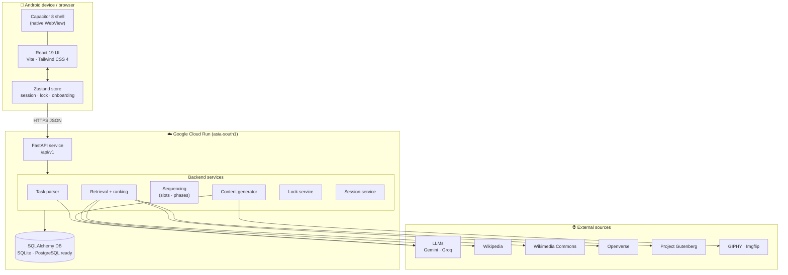

### Session state machine

The server is the **single source of truth for time**: the countdown and the lock never depend on the client clock.

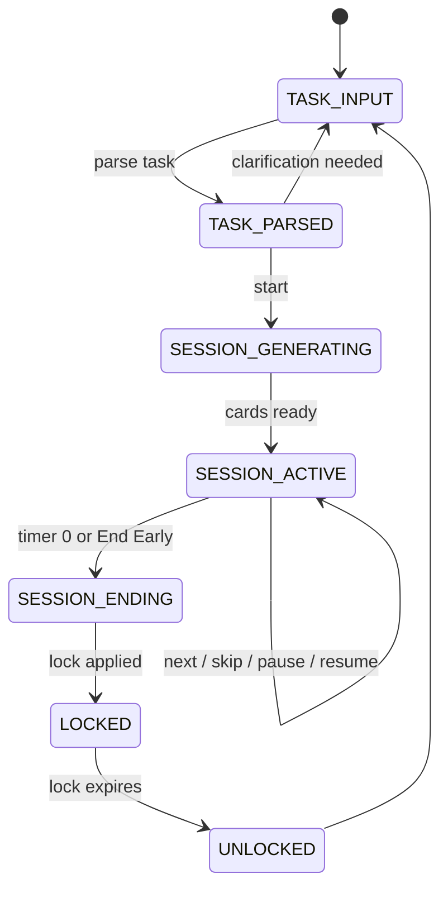

### Request flow

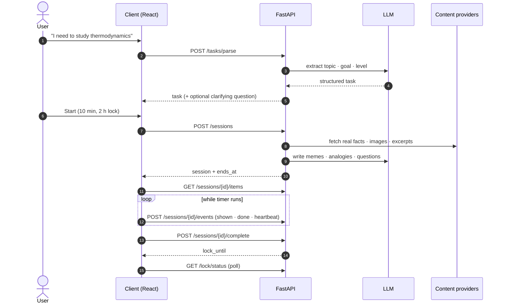

---

## 🧠 How a session is built

1. **Parse** the task into topic, goal and knowledge level.
2. **Retrieve** candidate content from the pool and fetch fresh items from real providers on demand.
3. **Rank** candidates with a configurable weighted score.
4. **Sequence** them into slots and phases (a meme always opens the session; humour, learning and a first-step nudge are balanced).
5. **Generate** missing cards (memes, analogies, questions) with the LLM, falling back to templates when offline.

**Ranking weights (MVP defaults)**

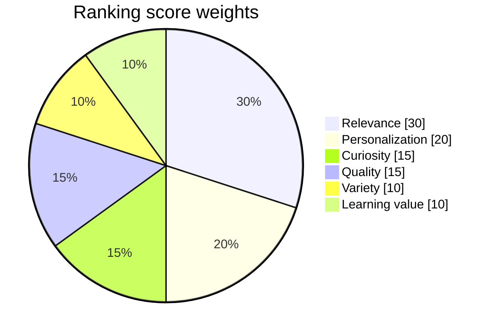

**Cards per session length**

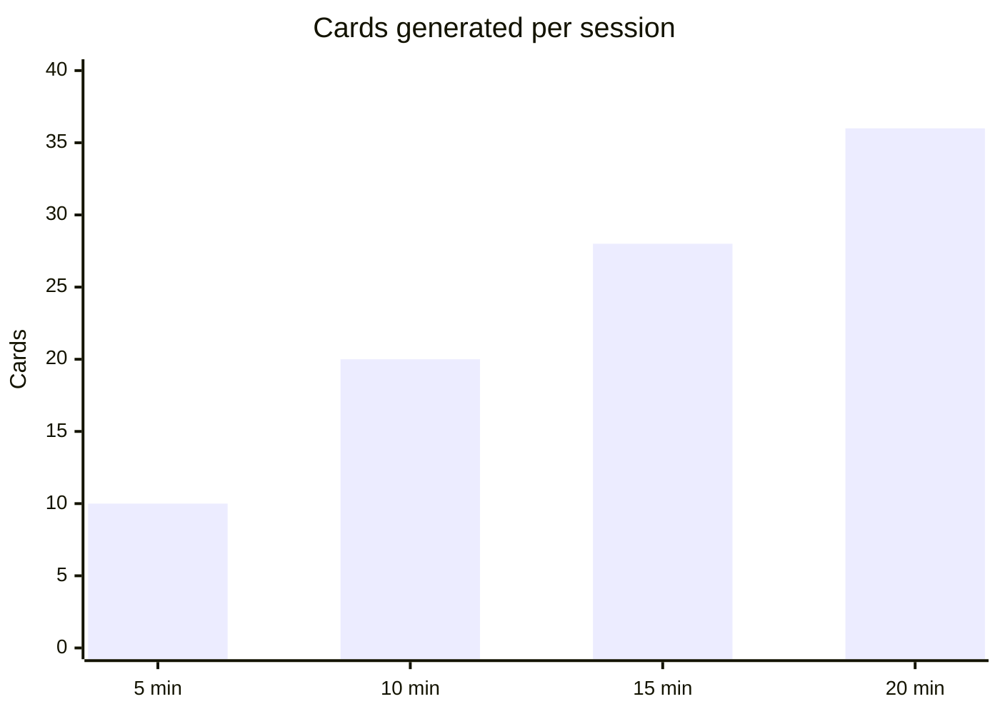

---

## 🧰 Tech stack

<div align="center">

### Frontend & mobile


### Backend & cloud


</div>

| Layer | Technology | Purpose |
|---|---|---|
| **UI** | React 19, TypeScript, Vite 8 | Component UI and fast builds |
| **Styling** | Tailwind CSS 4, custom CSS motion system | Themes, animations, transitions |
| **State** | Zustand | Session, lock and onboarding state |
| **Mobile shell** | Capacitor 8, Android Gradle | Packages the web app as an APK |
| **API** | FastAPI, Uvicorn, Pydantic v2 | Typed REST endpoints under `/api/v1` |
| **Data** | SQLAlchemy 2, SQLite (PostgreSQL + pgvector ready) | Users, tasks, sessions, content, locks |
| **AI** | Google Gemini, Groq (Llama) with failover, heuristic fallback | Task parsing and card writing |
| **Content** | Wikipedia, Wikimedia Commons, Openverse, Gutenberg, GIPHY, Imgflip | Real facts, images, excerpts, GIFs |
| **Hosting** | Docker, Google Cloud Run, Cloud Build | Continuous deployment from `main` |
| **CI/CD** | GitHub Actions | Builds and publishes the Android APK |
| **Testing** | pytest (32 tests) | Invariants, ranking, parsing, providers |

---

## 🛠️ How the app was made

1. **Concept first.** The idea was written up as a product spec, then split into a 16-document implementation plan in [`docs/`](docs/00-README.md) covering concept, architecture, UI, database, API, ranking, safety and roadmap.
2. **Vertical slice.** A thin end-to-end path came first: task input, session generation, a timed card session and a lock. SQLite and a heuristic parser made it run with zero setup.
3. **Real content.** Provider clients for Wikipedia, Wikimedia, Openverse and Gutenberg were added with licence and attribution tracking, then LLM layers (Gemini and Groq with failover) for parsing and card writing.
4. **Ranking and sequencing.** A weighted ranker and a slot-based sequencer keep sessions finite, varied and on-topic.
5. **Polish.** Screen push/pop transitions, card animations, swipe gestures, session pause/resume, a custom lockout, and one-time onboarding.
6. **Ship it.** The API was containerised and deployed to **Cloud Run** from GitHub. The client was wrapped with **Capacitor** and a **GitHub Actions** workflow now builds the Android APK on every push to `main`.

---

## 🗂️ Project structure

```text
pique-project/
├── apps/
│   └── client/                  # React + Vite + Capacitor app
│       ├── src/
│       │   ├── screens/         # Welcome, HowItWorks, FillDetails, Session, LockScreen
│       │   ├── components/      # CardView, Sheets, ScreenNavigator, AutoHeight, ui
│       │   ├── lib/             # api client, device id, theme
│       │   └── store.ts         # Zustand session / lock / onboarding store
│       └── android/             # Capacitor Android project
├── services/
│   └── api/                     # FastAPI backend
│       ├── app/
│       │   ├── routers/         # auth, tasks, sessions, lock, profile, content
│       │   ├── services/        # parser, retrieval, sequencing, generation, locks
│       │   ├── providers/       # wikipedia, wikimedia, openverse, gutendex
│       │   ├── ai/              # gemini, groq, prompts, embeddings
│       │   ├── models/ schemas/ core/ workers/
│       │   └── main.py
│       ├── tests/               # pytest suite
│       └── Dockerfile           # Cloud Run image
├── infra/                       # env.example, docker-compose (Postgres + Redis)
├── docs/                        # 16-part implementation plan + README assets
├── .github/workflows/           # build-apk.yml
└── dev.ps1                      # start API + client together (Windows)
```

---

## 💻 Run it locally

**Requirements:** Python 3.11+, Node.js 22+.

```powershell
# 1. Backend
cd services/api
python -m venv .venv
.\.venv\Scripts\pip install -r requirements.txt
.\.venv\Scripts\python -m uvicorn app.main:app --reload     # http://localhost:8000/docs

# 2. Client (new terminal)
cd apps/client
npm install
$env:VITE_API_URL = "http://localhost:8000"                # optional, defaults to the Cloud Run API
npm run dev                                                 # http://localhost:5173
```

Or on Windows, start both with `.\dev.ps1` from the repo root.

**Optional configuration.** Copy [`infra/env.example`](infra/env.example) to `infra/.env` and add keys. Everything works without them (template cards, no LLM).

| Variable | Purpose |
|---|---|
| `PIQUE_LLM_PROVIDER` | `groq`, `gemini` or a chain such as `groq,gemini` |
| `PIQUE_GROQ_API_KEY` / `PIQUE_GEMINI_API_KEY` | LLM keys |
| `PIQUE_GIPHY_API_KEY` | Real reaction GIFs |
| `PIQUE_DATABASE_URL` | SQLite by default, or PostgreSQL |
| `PIQUE_SECRET_KEY` | Token signing key (change in production) |

> 🔐 Real keys live only in `infra/.env`, which is git-ignored. Nothing secret is bundled into the APK.

**Run the tests**

```powershell
cd services/api
.\.venv\Scripts\python -m pytest
```

---

## 📦 Build the Android APK

The easiest route needs no local Android SDK. Push to `main` and the
[`build-apk.yml`](.github/workflows/build-apk.yml) workflow builds `Pique-debug.apk` and publishes it to
[Releases](https://github.com/shishirastogi/Pique/releases/tag/android-apk-latest).

To build locally you need **JDK 21** and the **Android SDK 36**:

```powershell
cd apps/client
npm run build
npx cap sync android
cd android
.\gradlew.bat assembleDebug
# → android/app/build/outputs/apk/debug/app-debug.apk
```

---

## ☁️ Deployment

| Part | Where | How |
|---|---|---|
| **API** | Google Cloud Run | Cloud Build deploys from `main` using [`services/api/Dockerfile`](services/api/Dockerfile) |
| **Android app** | GitHub Releases | GitHub Actions builds and uploads the APK |
| **API URL baked into the app** | `https://pique-api-175706581364.asia-south1.run.app` | Override with `VITE_API_URL` at build time |

---

## 📚 Documentation

The full implementation plan lives in [`docs/`](docs/00-README.md):

[Concept](docs/01-concept.md) ·
[Architecture](docs/02-architecture.md) ·
[Functions](docs/03-functions.md) ·
[Working](docs/04-working.md) ·
[UI spec](docs/05-ui-spec.md) ·
[Database](docs/06-database.md) ·
[Backend API](docs/07-backend-api.md) ·
[Data fetching](docs/08-data-fetching.md) ·
[Ranking](docs/09-recommendation-algorithms.md) ·
[Sequencing](docs/10-data-sorting-sequencing.md) ·
[Pipeline](docs/11-content-pipeline.md) ·
[Safety](docs/12-moderation-safety.md) ·
[Analytics](docs/13-analytics-experiments.md) ·
[Security](docs/14-security-privacy.md) ·
[Testing](docs/15-testing-qa.md) ·
[Roadmap](docs/16-roadmap.md)

---

<div align="center">

**Pique** · *Get curious. Then get to work.*

</div>
