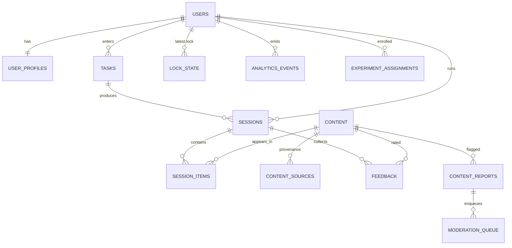

# 06 — Database Design

> PostgreSQL 16 + pgvector (system of record) · Redis 7 (ephemeral state). Expands idea doc §25. Migrations via Alembic; every table has `created_at timestamptz default now()` unless noted.

---

## 1. ERD (Mermaid)



---

## 2. Tables (DDL sketch)

### users
```sql
id            uuid pk default gen_random_uuid()
email         citext unique            -- nullable: anonymous-first (02 §2)
device_fp     text unique not null     -- device token subject
created_at    timestamptz
deleted_at    timestamptz              -- soft delete (14)
```

### user_profiles
```sql
user_id                 uuid pk references users(id)
language                text not null default 'en'         -- en|hi|hinglish
knowledge_default       text not null default 'beginner'   -- 03.A.2 levels
content_preferences     jsonb not null default '[]'        -- format checkboxes (05 §10.5)
humor_preference        text                                -- dry|absurd|sarcastic|...
interests               text[] not null default '{}'
study_areas             text[] not null default '{}'
region                  text                                -- optional, user-provided
lock_minutes            int  not null default 120           -- 60|120|180|240
default_duration_minutes int not null default 10            -- 5|10|15|20
personalization_enabled boolean not null default true
auto_advance            boolean not null default false
updated_at              timestamptz
```

### tasks
```sql
id           uuid pk
user_id      uuid references users(id)
raw_text     text not null
goal         text          -- exam_prep|design|learn|create|other
category     text          -- education|creative|work|personal
subject      text
topic        text not null
subtopics    jsonb not null default '[]'
level        text          -- beginner|intermediate|advanced|null
urgency      text
duration_minutes int
language     text not null default 'en'
confidence   real
session_id   uuid unique        -- backref filled after session creation
created_at   timestamptz
```
Indexes: `(user_id, created_at desc)`, `gin(to_tsvector('simple', topic))`, `(topic)`.

### sessions
```sql
id            uuid pk
user_id       uuid references users(id)
task_id       uuid references tasks(id)
status        text not null          -- SESSION_GENERATING|SESSION_ACTIVE|SESSION_ENDING|COMPLETED|ABANDONED|FAILED
duration_minutes int not null
planned_items int
started_at    timestamptz
ends_at       timestamptz            -- server-authoritative end
completed_at  timestamptz
abandon_reason text
started_work_confirmed boolean        -- initiation self-report (13)
initiation_reported_at timestamptz
experiment_arm  text                  -- control|treatment (13 §4)
offline       boolean default false
created_at    timestamptz
```
Indexes: `(user_id, started_at desc)`, `(status) where status in ('SESSION_ACTIVE')`.

### session_items
```sql
id              uuid pk
session_id      uuid references sessions(id) on delete cascade
content_id      uuid references content(id)      -- nullable=false; generated items are persisted first
position        int not null
phase           text not null        -- entertainment|curiosity|understanding|activation
planned_seconds int not null
shown_at        timestamptz
dwell_ms        int
skipped         boolean default false
engagement      jsonb                -- poll answer, hint used, challenge accepted...
unique(session_id, position)
```
Index: `(session_id, position)`.

### content
```sql
id              uuid pk
type            text not null        -- 16 types in 00 conventions
title           text
body            text not null
language        text not null default 'en'
topic           text not null
subtopics       jsonb not null default '[]'
tags            text[] not null default '{}'
difficulty      text                 -- beginner|intermediate|advanced
tone            text
humor_style     text
media           jsonb                  -- {kind: image|gif|svg|none, url, width, height, storage: hotlink|r2}
scores          jsonb not null default '{}'   -- {relevance, curiosity, quality, humor, learning} 0..1
embedding       vector(1024)         -- content semantic embedding
status          text not null default 'pending'  -- pending|active|quarantined|removed (12)
generated_by    text                 -- provider+model when provenance=generated
expires_at      timestamptz          -- hotlinked assets w/ leases (optional)
created_at      timestamptz
```
Indexes: `(type)`, `(topic)`, `gin(tags)`, `ivfflat(embedding vector_cosine_ops) lists=100` → upgrade HNSW at scale (`02` §10), `(status) where status='active'`, `gin(to_tsvector('english', coalesce(title,'')||' '||body))`.

### content_sources  (provenance — one row per external origin; idea doc §12)
```sql
id                   uuid pk
content_id           uuid references content(id) on delete cascade
provider             text not null   -- openverse|wikimedia|smithsonian|loc|gutenberg|unsplash|giphy|generated
source_id            text
source_url           text not null
creator              text
license              text            -- CC0|CC-BY|CC-BY-SA|PDM|provider-terms|owned
license_url          text
attribution_required boolean not null default false
attribution_text     text
fetchable            boolean not null default false  -- may we cache bytes? (08 §6)
fetched_at           timestamptz
unique(provider, source_id)
```

### feedback
```sql
id         uuid pk
user_id    uuid references users(id)
session_id uuid references sessions(id)
content_id uuid references content(id)
rating     smallint      -- +1|-1 (skip signal also lands here)
reason     text
created_at timestamptz
```
Index: `(content_id)`, `(user_id, created_at desc)`.

### content_reports
```sql
id         uuid pk
user_id    uuid references users(id)
content_id uuid references content(id)
reason     text not null   -- inappropriate|wrong|copyright|off_topic|other
comment    text
status     text not null default 'open'  -- open|triaged|resolved
created_at timestamptz
```

### lock_state
```sql
user_id     uuid pk references users(id)
lock_until  timestamptz not null
session_id  uuid references sessions(id)
broken_at   timestamptz              -- set by emergency unlock
created_at  timestamptz
```
(One active lock per user; history derivable from `sessions`.)

### analytics_events (append-only)
```sql
id          bigint generated always as identity pk
user_id     uuid
session_id  uuid
event_type  text not null          -- taxonomy in 13 §2
payload     jsonb not null default '{}'
client_ts   timestamptz
server_ts   timestamptz not null default now()
```
Indexes: `(event_type, server_ts desc)`, `(session_id)`. Partition monthly when > 5M/day (`02` §10).

### moderation_queue
```sql
id          uuid pk
content_id  uuid references content(id)
source      text         -- auto_screen|user_report|generated_check
reason      text
status      text not null default 'pending'  -- pending|approved|removed
reviewed_by text
reviewed_at timestamptz
created_at  timestamptz
```

### experiment_assignments
```sql
user_id     uuid references users(id)
experiment  text not null
arm         text not null            -- control|treatment
assigned_at timestamptz not null default now()
primary key (user_id, experiment)
```

---

## 3. Redis Schema (ephemeral; nothing here is source of truth)

| Key | Type | TTL | Purpose |
|---|---|---|---|
| `lock:{user_id}` | string JSON `{lock_until, session_id}` | = lock duration | fast lock reads (`04` §5) |
| `session:{id}:live` | hash `{cursor, last_hb}` | ends_at + 10 min | heartbeat state, crash detection |
| `rankcache:{digest}` | string JSON ranked pool digest | 6 h | reuse ranking for near-identical task+profile (`07` §6) |
| `analogy:{topic}:{interest}` | string content id | 7 d | reuse good analogies (`03` A.6) |
| `rate:{user_id}:{route}` | counter | 60 s | rate limiting |
| `cbr:{provider}` | string | 300 s | circuit-breaker open marker (`08` §7) |
| `queue:ingest` | ARQ | — | pipeline jobs (`11`) |

---

## 4. Retention, Privacy & Migration Policy

- **Retention:** raw `analytics_events` kept 12 months → aggregated daily rollups; `session_items.dwell_ms` kept (core learning signal). Soft-deleted users purged after 30 days (hard cascade). Details + user-facing copy in `14` §3.
- **Migrations:** Alembic, one-way, tested in CI against prod-shaped snapshot (`15`). Destructive changes = expand/contract pattern, never in-place drops.
- **Seeds:** `alembic`-adjacent seed script inserts base config rows (weight configs, provider registry) + ~200 curated content items for dev.
- **Config rows:** ranking weights and phase templates are stored in a `config` table (key jsonb primary) so experiments change weights without deploys (`09` §5, `10` §3).
